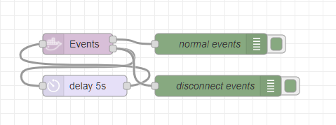
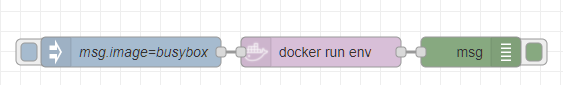

# docker container actions

## create

* POST /containers/create [API v1.40 - ContainerCreate]https://docs.docker.com/engine/api/v1.40/#operation/ContainerCreate

### Example

```json
[{"id":"680bd5e38a20b6fa","type":"docker-container-actions","z":"f94d0c18.dc75e","name":"","config":"380f85b7.feca6a","container":"","action":"create","options":"{\"Image\":\"ubuntu\",\"Cmd\":[\"/bin/bash\"]}","optionstype":"json","image":"","imagetype":"str","pullimage":false,"createOptions":"","createOptionsType":"json","x":630,"y":580,"wires":[["25fb81e898ea2522"]]},{"id":"c67e0f0392ca92a0","type":"inject","z":"f94d0c18.dc75e","name":"","props":[{"p":"payload"},{"p":"topic","vt":"str"}],"repeat":"","crontab":"","once":false,"onceDelay":0.1,"topic":"","payloadType":"date","x":140,"y":580,"wires":[["11be8388b8aa5c14"]]},{"id":"25fb81e898ea2522","type":"debug","z":"f94d0c18.dc75e","name":"","active":true,"tosidebar":true,"console":false,"tostatus":false,"complete":"false","statusVal":"","statusType":"auto","x":810,"y":580,"wires":[]},{"id":"11be8388b8aa5c14","type":"function","z":"f94d0c18.dc75e","name":"","func":"msg.options = {Image: 'ubuntu', Cmd: ['/bin/bash']}\nmsg.action = \"create\"\nreturn msg;\n","outputs":1,"noerr":0,"initialize":"","finalize":"","libs":[],"x":280,"y":580,"wires":[["632934d21f430b5e"]]},{"id":"632934d21f430b5e","type":"docker-container-actions","z":"f94d0c18.dc75e","name":"","config":"380f85b7.feca6a","container":"","action":"pull","options":"","optionstype":"str","image":"ubuntu","imagetype":"str","pullimage":false,"createOptions":"","createOptionsType":"json","x":440,"y":580,"wires":[["680bd5e38a20b6fa"]]},{"id":"380f85b7.feca6a","type":"docker-configuration","host":"10.0.0.185","port":"2375"}]
```



--- 
## exec 

* POST /containers/{id}/exec [API v1.40 - ContainerExec](https://docs.docker.com/engine/api/v1.40/#operation/ContainerExec)

### Example

```json
[{"id":"d52cb21.713fc5","type":"docker-container-actions","z":"f94d0c18.dc75e","name":"docker run env","config":"380f85b7.feca6a","container":"jovial_brown","action":"run","options":"env","optionstype":"str","image":"image","imagetype":"msg","pullimage":true,"createOptions":"{\"Env\":[\"FOO=bar\",\"BAZ=quux\"]}","startOptions":"","createOptionsType":"json","startOptionsType":"json","x":360,"y":280,"wires":[["917751d3.0a969"]]},{"id":"756ba008.62f8b","type":"inject","z":"f94d0c18.dc75e","name":"msg.image=busybox","props":[{"p":"image","v":"busybox","vt":"str"}],"repeat":"","crontab":"","once":false,"onceDelay":0.1,"topic":"","x":170,"y":280,"wires":[["d52cb21.713fc5"]]},{"id":"917751d3.0a969","type":"debug","z":"f94d0c18.dc75e","name":"","active":true,"tosidebar":true,"console":false,"tostatus":false,"complete":"true","targetType":"full","statusVal":"","statusType":"auto","x":510,"y":280,"wires":[]},{"id":"380f85b7.feca6a","type":"docker-configuration","host":"10.0.0.185","port":"2375"}]
```




