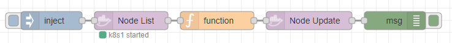

# docker node actions

## update 

* POST /nodes/{id}/update [API v1.40 - NodeUpdate](https://docs.docker.com/engine/api/v1.40/#operation/NodeUpdate)

### Example

add label to node

```json
[{"id":"d2ad6605.520468","type":"debug","z":"f94d0c18.dc75e","name":"","active":true,"tosidebar":true,"console":false,"tostatus":false,"complete":"true","targetType":"full","statusVal":"","statusType":"auto","x":690,"y":120,"wires":[]},{"id":"7456c063cf783e60","type":"docker-node-actions","z":"f94d0c18.dc75e","name":"","config":"380f85b7.feca6a","node":"k8s1","action":"list","options":"{\"version\":9,\"Labels\":{\"foo\":\"bar\"},\"Role\":\"manager\",\"Availability\":\"active\"}","optionstype":"json","x":260,"y":120,"wires":[["f7772522df8f44cd"]]},{"id":"9b73ffde8d923922","type":"inject","z":"f94d0c18.dc75e","name":"","props":[{"p":"labels","v":"{\"blub\":\"bla\"}","vt":"json"}],"repeat":"","crontab":"","once":false,"onceDelay":0.1,"topic":"","x":130,"y":120,"wires":[["7456c063cf783e60"]]},{"id":"f7772522df8f44cd","type":"function","z":"f94d0c18.dc75e","name":"","func":"const dockernode = msg.payload[0]\nconst version = dockernode.Version.Index;\nconst spec = dockernode.Spec;\n\nspec.Labels = Object.assign(spec.Labels, msg.labels);\n\nmsg.payload= {\n    options: Object.assign(spec, {version})\n}\n    \nreturn msg;","outputs":1,"noerr":0,"initialize":"","finalize":"","libs":[],"x":400,"y":120,"wires":[["29870dc3888ce702"]]},{"id":"29870dc3888ce702","type":"docker-node-actions","z":"f94d0c18.dc75e","name":"","config":"380f85b7.feca6a","node":"k8s1","action":"update","options":"payload.options","optionstype":"msg","x":550,"y":120,"wires":[["d2ad6605.520468"]]},{"id":"380f85b7.feca6a","type":"docker-configuration","host":"10.0.0.185","port":"2375"}]
```

