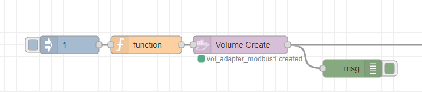

# docker volume actions

## create 

* POST /volumes/create [API v1.40 - VolumeCreate](https://docs.docker.com/engine/api/v1.40/#operation/VolumeCreate)

### Example

```json
[{"id":"c67e0f0392ca92a0","type":"inject","z":"f94d0c18.dc75e","name":"","props":[{"p":"payload"},{"p":"topic","vt":"str"}],"repeat":"","crontab":"","once":false,"onceDelay":0.1,"topic":"","payload":"1","payloadType":"num","x":130,"y":580,"wires":[["11be8388b8aa5c14"]]},{"id":"11be8388b8aa5c14","type":"function","z":"f94d0c18.dc75e","name":"","func":"let number=msg.payload;\nlet containername=\"adapter_modbus\"+number;\nlet volumename=\"vol_adapter_modbus\" + number;\nlet porthost=55500 + number;\nlet adapterip=100 + number;\n\n//--ip 172.20.0.$adapterip \nmsg.volume=volumename;\nmsg.options = JSON.parse(`\n{\n    \"Image\": \"node-red_modus_image\", \n    \"name\": \"${containername}\",\n    \"ExposedPorts\": { \"${porthost}\": {} },\n    \"HostConfig\": {\n        \"Binds\":[\n             \"${volumename}:/data\"\n        ],\n        \"NetworkMode\": \"adapter_net\",\n        \"PortBindings\": {\n            \"${porthost}\": \"${porthost}\"\n        }\n      }\n}`)\n\nmsg.action = \"create\"\nreturn msg;\n","outputs":1,"noerr":0,"initialize":"","finalize":"","libs":[],"x":260,"y":580,"wires":[["ae97d41aba1a0bf2"]]},{"id":"ae97d41aba1a0bf2","type":"docker-volume-actions","z":"f94d0c18.dc75e","name":"","config":"380f85b7.feca6a","volume":"volume","volumetype":"msg","action":"create","x":420,"y":580,"wires":[["46f12be18a732ab5","632934d21f430b5e"]]},{"id":"46f12be18a732ab5","type":"debug","z":"f94d0c18.dc75e","name":"","active":true,"tosidebar":true,"console":false,"tostatus":false,"complete":"true","targetType":"full","statusVal":"","statusType":"auto","x":610,"y":620,"wires":[]},{"id":"380f85b7.feca6a","type":"docker-configuration","host":"10.0.0.185","port":"2375"}]
```

