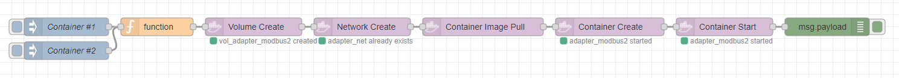

# Examples


## pull-create-start

Actions: 

- create volume
- create network
- image pull
- container create 
- container start

```json
[{"id":"680bd5e38a20b6fa","type":"docker-container-actions","z":"f94d0c18.dc75e","name":"","config":"380f85b7.feca6a","container":"container","containertype":"msg","action":"create","options":"options","optionstype":"msg","image":"","imagetype":"str","pullimage":false,"createOptions":"","createOptionsType":"json","x":1010,"y":580,"wires":[["65b6a4c3a124dd6f"]]},{"id":"c67e0f0392ca92a0","type":"inject","z":"f94d0c18.dc75e","name":"Container #1","props":[{"p":"payload"}],"repeat":"","crontab":"","once":false,"onceDelay":0.1,"topic":"","payload":"1","payloadType":"num","x":110,"y":580,"wires":[["11be8388b8aa5c14"]]},{"id":"25fb81e898ea2522","type":"debug","z":"f94d0c18.dc75e","name":"","active":true,"tosidebar":true,"console":false,"tostatus":false,"complete":"payload","targetType":"msg","statusVal":"","statusType":"auto","x":1370,"y":580,"wires":[]},{"id":"11be8388b8aa5c14","type":"function","z":"f94d0c18.dc75e","name":"","func":"let number=msg.payload;\nlet porthost=55500 + number;\nlet adapterip=100 + number;\n\nmsg.volume=\"vol_adapter_modbus\" + number;\nmsg.image=\"ubuntu\"\nmsg.container=\"adapter_modbus\"+number;\nmsg.network=\"adapter_net\"\n\nmsg.options = JSON.parse(`\n{\n    \"Image\": \"ubuntu\", \n    \"Cmd\": [\"/bin/sh\"],\n    \"ExposedPorts\": { \"${porthost}\": {} },\n    \"HostConfig\": {\n        \"Binds\":[\n             \"${msg.volume}:/data\"\n        ],\n        \"NetworkMode\": \"${msg.network}\",\n        \"PortBindings\": {\n            \"${porthost}/tcp\": [\n                { \"HostPort\" : \"${porthost}\"}\n            ]\n        }\n      }\n}`)\n\nmsg.action = \"create\"\nreturn msg;\n","outputs":1,"noerr":0,"initialize":"","finalize":"","libs":[],"x":260,"y":580,"wires":[["ae97d41aba1a0bf2"]]},{"id":"632934d21f430b5e","type":"docker-container-actions","z":"f94d0c18.dc75e","name":"","config":"380f85b7.feca6a","container":"","containertype":"str","action":"pull","options":"","optionstype":"str","image":"image","imagetype":"msg","pullimage":false,"createOptions":"","createOptionsType":"json","x":800,"y":580,"wires":[["680bd5e38a20b6fa"]]},{"id":"ae97d41aba1a0bf2","type":"docker-volume-actions","z":"f94d0c18.dc75e","name":"","config":"380f85b7.feca6a","volume":"volume","volumetype":"msg","action":"create","x":420,"y":580,"wires":[["4b3c77b2c7bb3c07"]]},{"id":"65b6a4c3a124dd6f","type":"docker-container-actions","z":"f94d0c18.dc75e","name":"","config":"380f85b7.feca6a","container":"container","containertype":"msg","action":"start","options":"","optionstype":"str","image":"","imagetype":"str","pullimage":false,"createOptions":"","createOptionsType":"json","x":1200,"y":580,"wires":[["25fb81e898ea2522"]]},{"id":"4b3c77b2c7bb3c07","type":"docker-network-actions","z":"f94d0c18.dc75e","name":"","config":"380f85b7.feca6a","network":"network","networktype":"msg","options":"{}","optionstype":"json","action":"create","x":600,"y":580,"wires":[["632934d21f430b5e"]]},{"id":"a30ba7352e40dfb4","type":"inject","z":"f94d0c18.dc75e","name":"Container #2","props":[{"p":"payload"}],"repeat":"","crontab":"","once":false,"onceDelay":0.1,"topic":"","payload":"2","payloadType":"num","x":110,"y":620,"wires":[["11be8388b8aa5c14"]]},{"id":"380f85b7.feca6a","type":"docker-configuration","host":"10.0.0.185","port":"2375"}]
```

